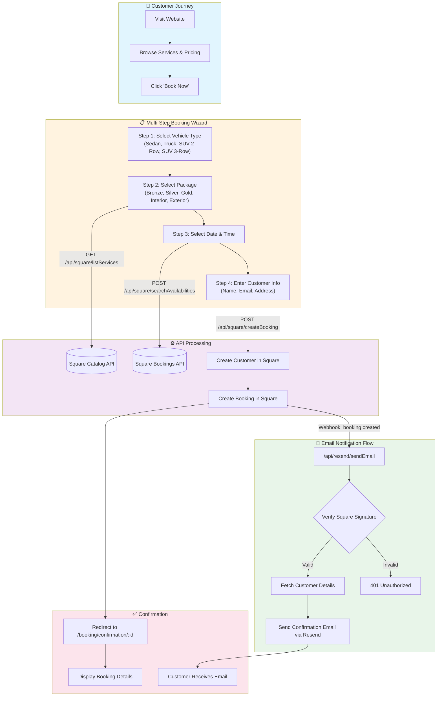
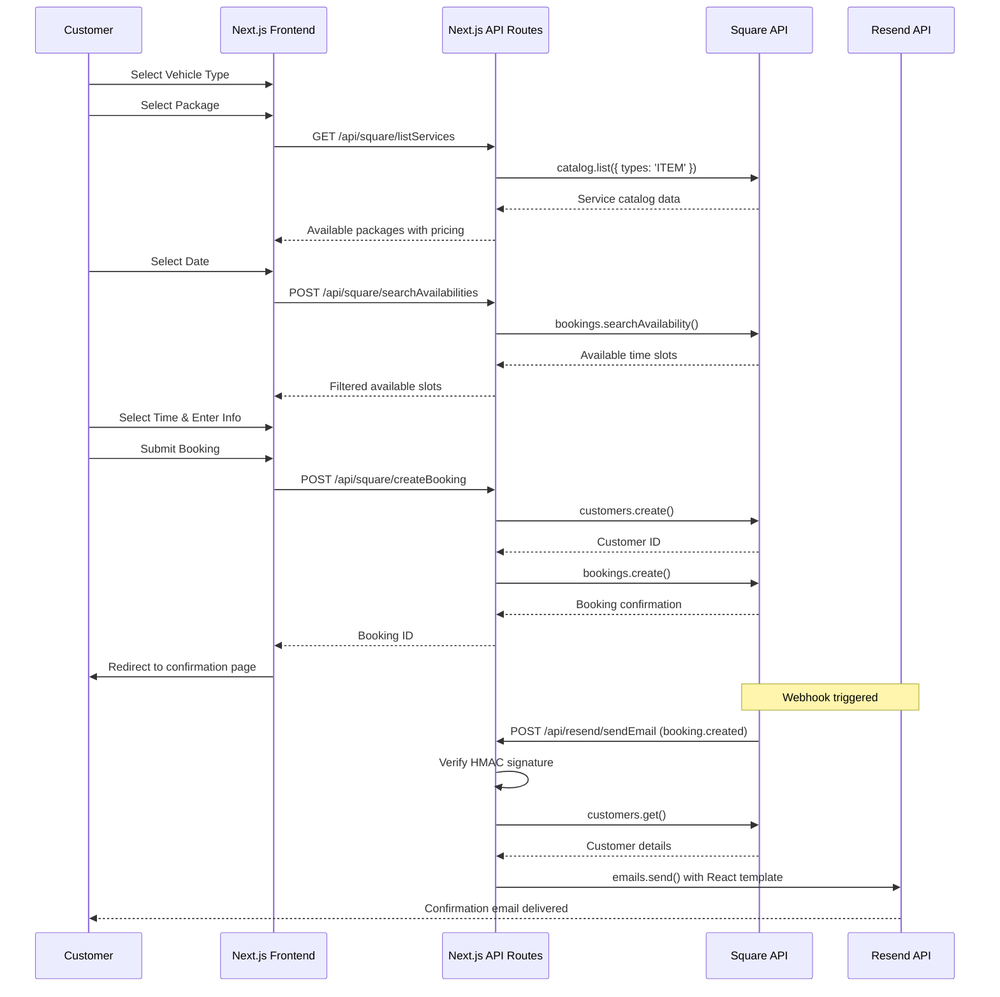

# Paul & Tev Shine Time

A modern, full-stack mobile auto detailing booking platform built with Next.js 14+, integrated with Square for appointments and Resend for email notifications.


---

## 📖 Project Overview

**Paul & Tev Shine Time** is a family-owned mobile car detailing business serving the West Michigan area. This web application provides customers with a seamless booking experience, allowing them to:

- Browse available detailing packages (Bronze, Silver, Gold, Interior, Exterior)
- Select their vehicle type for accurate pricing
- Choose available appointment slots in real-time
- Complete bookings with automatic email confirmations

The platform integrates directly with **Square Bookings API** for scheduling and customer management, and **Resend** for transactional emails via webhooks.

---

## ✨ Key Features

| Feature                       | Description                                                              |
| ----------------------------- | ------------------------------------------------------------------------ |
| **Multi-Step Booking Wizard** | Guided 4-step process: Vehicle → Package → Date/Time → Confirmation      |
| **Dynamic Pricing**           | Prices adjust based on vehicle type (Sedan, Truck, SUV 2-Row, SUV 3-Row) |
| **Real-Time Availability**    | Fetches live appointment slots from Square Bookings API                  |
| **Webhook-Driven Emails**     | Automatic confirmation emails triggered by Square booking events         |
| **Responsive Design**         | Mobile-first UI with glassmorphism effects and modern aesthetics         |
| **CI/CD Pipeline**            | Automated testing, linting, and Vercel deployment via GitHub Actions     |

---

## 🏗️ System Design

### Architecture Overview

The application follows a **client-server architecture** with Next.js App Router handling both the frontend and API routes. External services (Square, Resend) are integrated via RESTful APIs and webhooks.

```
┌─────────────────────────────────────────────────────────────────────────────┐
│                              CLIENT LAYER                                    │
├─────────────────────────────────────────────────────────────────────────────┤
│  Next.js App Router (React 19)                                              │
│  ├── Landing Page (Hero, Pricing, Gallery, FAQ, Contact)                    │
│  ├── Booking Flow (Multi-step wizard with context state)                    │
│  └── Confirmation Page (Dynamic route /booking/confirmation/[id])           │
└─────────────────────────────────────────────────────────────────────────────┘
                                     │
                                     ▼
┌─────────────────────────────────────────────────────────────────────────────┐
│                              API LAYER                                       │
├─────────────────────────────────────────────────────────────────────────────┤
│  Next.js API Routes (/app/api/)                                             │
│  ├── /square/listServices      → GET catalog items                          │
│  ├── /square/searchAvailabilities → POST check time slots                   │
│  ├── /square/createBooking     → POST create appointment                    │
│  ├── /square/updateBooking     → PUT modify appointment                     │
│  ├── /square/cancelBooking     → PUT cancel appointment                     │
│  └── /resend/sendEmail         → POST webhook receiver (Square → Email)     │
└─────────────────────────────────────────────────────────────────────────────┘
                                     │
                                     ▼
┌─────────────────────────────────────────────────────────────────────────────┐
│                           EXTERNAL SERVICES                                  │
├─────────────────────────────────────────────────────────────────────────────┤
│  Square API                          │  Resend API                          │
│  ├── Bookings (appointments)         │  └── Transactional Emails            │
│  ├── Customers (CRM)                 │                                      │
│  └── Catalog (services/pricing)      │                                      │
└─────────────────────────────────────────────────────────────────────────────┘
```

### State Management

The booking flow uses **React Context** for state management:

- **`BookingContext`** — Stores selected vehicle, package, date/time, and user info
- **`StepperContext`** — Tracks current step in the booking wizard (0-3)

### Component Structure

```
components/
├── booking/           # Booking flow components
│   ├── BookingStepper.tsx      # Main wizard controller
│   ├── SelectVehicle.tsx       # Step 0: Vehicle selection
│   ├── SelectPackage.tsx       # Step 1: Package selection
│   ├── SelectDateTime.tsx      # Step 2: Date/time picker
│   ├── BookingSummary.tsx      # Step 3: Review & customer info
│   └── confirmation/           # Post-booking components
├── sections/          # Landing page sections
├── ui/                # Reusable UI components
└── contact/           # Contact form
```

---

## 🔄 Booking System Flow



### Sequence Diagram



---

## 🛠️ Tech Stack

| Category             | Technology                                |
| -------------------- | ----------------------------------------- |
| **Framework**        | Next.js 14+ (App Router, Turbopack)       |
| **Language**         | TypeScript 5.7                            |
| **Styling**          | Tailwind CSS 3.4, HeroUI                  |
| **State**            | React Context API                         |
| **Animations**       | Framer Motion, Animate.css                |
| **Date Handling**    | Day.js, @internationalized/date           |
| **Payments/Booking** | Square SDK (Bookings, Customers, Catalog) |
| **Email**            | Resend (React Email Templates)            |
| **Maps**             | Mapbox Search                             |
| **Validation**       | Zod                                       |
| **Testing**          | Jest, React Testing Library               |
| **CI/CD**            | GitHub Actions, Vercel                    |

---

## 📁 Project Structure

```
ptst-2/
├── app/
│   ├── api/
│   │   ├── resend/sendEmail/       # Webhook endpoint for emails
│   │   └── square/                 # Square API integrations
│   │       ├── createBooking/
│   │       ├── listServices/
│   │       ├── searchAvailabilities/
│   │       ├── updateBooking/
│   │       └── cancelBooking/
│   ├── booking/
│   │   ├── page.tsx                # Booking wizard page
│   │   └── confirmation/[id]/      # Dynamic confirmation page
│   └── page.tsx                    # Landing page
├── components/
│   ├── booking/                    # Booking flow components
│   ├── sections/                   # Landing page sections
│   └── ui/                         # Reusable UI components
├── context/                        # React Context providers
├── hooks/                          # Custom React hooks
├── lib/
│   ├── api/                        # API client configurations
│   ├── data/                       # Static data & fetch functions
│   ├── definitions/                # TypeScript type definitions
│   └── utils/                      # Utility functions
└── public/                         # Static assets
```

---

## 🚀 Getting Started

### Prerequisites

- Node.js 20+
- npm or yarn
- Square Developer Account
- Resend Account

### Environment Variables

Create a `.env.local` file:

```env
# Square API
SQUARE_SANDBOX_ACCESS_TOKEN=your_square_sandbox_token
SQUARE_LOCATION_ID=your_location_id
SQUARE_TEAM_MEMBER_ID=your_team_member_id
SQUARE_SIGNATURE_KEY=your_webhook_signature_key
SQUARE_NOTIFICATION_URL=your_webhook_url

# Resend
RESEND_API_KEY=your_resend_api_key

# Mapbox
NEXT_PUBLIC_MAPBOX_ACCESS_TOKEN=your_mapbox_token
```

### Installation

```bash
# Clone the repository
git clone https://github.com/your-username/ptst-2.git

# Install dependencies
npm install

# Run development server
npm run dev

# Run tests
npm test

# Build for production
npm run build
```

---

## 🧪 Testing

The project uses **Jest** and **React Testing Library** for unit and integration tests:

```bash
# Run all tests
npm test

# Watch mode
npm run test:watch

# Coverage report
npm run test:coverage
```

Test files are co-located with their components in `__tests__/` directories.

---

## 🔄 CI/CD Pipeline

The GitHub Actions workflow (`.github/workflows/ci-cd.yml`) automates:

1. **Lint** — ESLint + Prettier checks
2. **Test** — Jest test suite
3. **Build** — Next.js production build
4. **Deploy** — Vercel (preview on branches, production on `main`)

---

## 📄 License

This project is private and proprietary to Paul & Tev Shine Time.

---

## 👥 Authors

- **Tevin Williams** — Owner & Publisher
- **Marques Smalley** — Developer & Creator

---

<p align="center">
  <em>In loving memory of Paul Williams ❤️</em>
</p>
